# UniBot Controlled Exam Rehearsal v1

Status: `ready_for_institutional_rehearsal_review`, nicht für echte Prüfungen
freigegeben (`exam_deployment_status: not_cleared`).

Implementierung und Dokumentation: Gretel / Codex. GLM darf ausschließlich
öffentliche Entwicklungsdateien vorschlagen und gegenprüfen. Notebook- oder
Lerninhalte sind für Provider gesperrt. Julius bleibt menschlicher Merge- und
Release-Verantwortlicher.

## Zweck und Grenze

Die Rehearsal-Version bildet den vollständigen technischen Ablauf mit genau
einem veröffentlichten synthetischen Python-Notebook ab. Sie ist ein
reproduzierbares Prüfobjekt für Universität, Lehre, Prüfungsamt, KI-Office,
Datenschutz, IT-Sicherheit und Barrierefreiheit. Sie ist weder eine echte
Klausur noch eine rechtliche, didaktische oder institutionelle Freigabe.

Ausgeschlossen bleiben Benotung, Proctoring, Überwachung, KI-Erkennung,
Täuschungserkennung, automatische Abgabe und automatische Entscheidung über
Nachteilsausgleich oder Prüfungszulässigkeit.

## Ablauf

```mermaid
flowchart LR
    A["Öffentliches synthetisches Notebook"] --> B["Import, Bereinigung und Ausgangshash"]
    B --> C["Unveränderlicher Rehearsal-Vertrag"]
    C --> D["Host offline und Jupyter nur über Loopback"]
    D --> E["Bearbeitung mit A0-A2-Hilfe"]
    E --> F["Jupyter-Speicherbestätigung"]
    F --> G["Gateway stoppen und Arbeitsstand einfrieren"]
    G --> H["Atomarer .ipynb-Export"]
    H --> I["Hash-Beleg und unabhängige Verifikation"]
```



Der feste Hash der veröffentlichten Rohdatei lautet
`f65a9b818bd0247cd1026d2750352597aaf47c672796374965d33379286c2b50`.
Der unabhängig festgelegte kanonische Hash der bereinigten Ausgangsdatei ist
`1a1d52f72afe70128d691f83e8ed197c171b07814cc4cd4635af8613b87fa9c1`.
Beide Werte müssen übereinstimmen, sodass ein veränderter Importbeleg kein
anderes Notebook einschleusen kann. Andere Notebooks werden in v1 abgewiesen.
Die bereinigte Ausgangsdatei bleibt unverändert; Jupyter bearbeitet eine
getrennte private Arbeitskopie.

## Vertrag und Hilfe

`ExamRehearsalContractV1` bindet Ausgangs- und Bereinigungshash,
Tutor-Regelpaket, lokale Lernsitzung, Netzwerkregel, Aufbewahrung und die
Hilfestufen A0 bis A2. Vertrag und veränderlicher Laufzustand liegen in
getrennten Dateien mit Benutzerrechten. Eine Hashänderung blockiert den Lauf.

Der deterministische Tutor verlangt einen eigenen Versuch. A3 und A4 werden
im Rehearsal-Transport abgewiesen. Vollständiger Code, Endwerte und fertige
Interpretation bleiben durch den Guardian gesperrt. Der Tutor führt erfassten
Notebookcode nicht aus.

Es darf immer nur eine aktive lokale Lern- oder Rehearsal-Sitzung geben. CLI
und Companion blockieren einen zweiten Start vor Netzwerkprüfung und
Dateierzeugung.

## Netz- und Prozessgrenze

Der Lauf startet nur auf macOS, wenn `sandbox-exec` vorhanden und kein externer
Default-Route aktiv ist. Der Jupyter-Prozess und seine Kernel erhalten durch
das Profil `macos-sandbox-exec-loopback-host-offline-v1` ausschließlich
Loopback-Netz. Ein unabhängiger lokaler Wächter prüft den Host weiter. Kehrt
eine externe Route zurück, wird der Lauf als `aborted` markiert und die
Jupyter-Prozessgruppe beendet.

Jupyter sieht als Serverwurzel nur das getrennte Arbeitsverzeichnis. Vertrag,
Zustand und Beleg liegen außerhalb dieser Oberfläche. Der Prozess erbt keine
Provider- oder API-Schlüssel und verwendet eigene leere Konfigurations-,
Cache-, IPython- und Laufzeitverzeichnisse. Diese Begrenzung ist keine
vollständige Dateisystem-Isolation des macOS-Benutzerkontos: Notebookcode läuft
weiterhin mit den Rechten der angemeldeten Person. Eine echte Prüfung benötigt
deshalb ein institutionell verwaltetes, inhaltsarm bereitgestelltes Konto oder
Gerät.

Diese macOS-Isolation ist eine überprüfbare Demonstrationslösung. Sie ersetzt
keinen institutionell verwalteten Rechner, MDM-, Browser-, Netzwerk- oder
Aufsichtsbeschluss. Das öffentliche `NetworkIsolationProvider`-Protokoll erlaubt
später einen verwalteten Anbieter, ohne Tutor- und Beleglogik umzubauen.

## Abschluss und Datenschutz

Vor dem Abschluss bestätigt der sichtbare lokale Jupyter-Adapter den
Speichervorgang, ohne Notebooktext zu lesen. Die Bestätigung ist an Host, Port
und den festen URL-Pfad des gestarteten Rehearsal-Notebooks gebunden. Ein
anderer Loopback-Tab sowie eine fehlende oder mehrdeutige Speicherschaltfläche
blockieren den Abschluss. Danach stoppt UniBot das Gateway, validiert die
Arbeitskopie als nbformat-v4-Datei und öffnet den nativen macOS-Speicherdialog.
Notebook und Beleg werden jeweils atomar geschrieben.

Scheitert das Vorbereiten oder das Speichern des aktiven Laufzustands, entfernt
UniBot unvollständige Verzeichnisse und beendet Jupyter sowie den
Netzwerk-Wächter vor der Fehlermeldung. Eine Sitzung wird nie still fortgesetzt.

`ExamSubmissionManifestV1` enthält nur:

- Ausgangs-, Vertrags-, Netzwerk-, Hilfenachweis- und Endhash,
- Zeitpunkt sowie Zell-, Codezellen- und Ausgabeanzahl,
- A0-A2-Grenze, Provideraufrufe `0` und Status `not_cleared`.

Der Beleg enthält weder Zelltext, Ausgaben, Namen, Transkript noch lokale
Pfade. Das exportierte Notebook bleibt lokal und enthält die tatsächlich
bearbeiteten Zellen und erzeugten Ausgaben. Es erfolgt keine automatische
Übertragung. SHA-256 weist Integrität, aber keine Identität oder Urheberschaft
nach.

## Öffentliche Bedienung

```text
unibot rehearsal start MANIFEST_JSON
unibot rehearsal status [REHEARSAL_ID]
unibot rehearsal finish REHEARSAL_ID --output COMPLETED.ipynb
unibot rehearsal verify COMPLETED.ipynb COMPLETED.unibot-receipt.json
unibot rehearsal delete REHEARSAL_ID
```

Das Sidepanel bietet dieselbe Kette über Native Messaging mit
`rehearsal.start`, `rehearsal.status`, `rehearsal.finish` und
`rehearsal.delete`. Übungsmodus A0-A4 und Rehearsal-Modus A0-A2 bleiben
getrennt.

## Reproduzierbare Prüfung

1. Öffentliche Fixture importieren und Vertragshash festhalten.
2. Externe Socket-, DNS- und HTTPS-Verbindungen aus der macOS-Sandbox prüfen;
   sie müssen scheitern. Eine Loopback-Verbindung muss funktionieren.
3. Einen eigenen synthetischen Zellversuch speichern und A0, A1 und A2 testen.
4. A3, A4 und eine vollständige Lösung anfragen; alle müssen blockiert bleiben.
5. Simulation abschließen, Notebook und Beleg exportieren und mit
   `unibot rehearsal verify` prüfen.
6. Notebook oder Beleg verändern; die Wiederholungsprüfung muss blockieren.
7. Chrome neu starten, einen aktiven Lauf wieder aufnehmen und anschließend
   lokal löschen.
8. Tastatur, Fokus, Statusansagen, 200-Prozent-Zoom, 280-Pixel-Sidepanel und
   Screenreader mit ausschließlich synthetischen Inhalten menschlich prüfen.

Automatisierte Tests belegen den Prototyp, aber keine WCAG-Konformität,
Lernwirksamkeit oder Prüfungszulässigkeit. Vor einem echten Einsatz bleiben
schriftliche Entscheidungen der zuständigen Hochschulstellen, eine verwaltete
Umgebung, ein Notfall- und Widerspruchsweg sowie eine beaufsichtigte Pilotierung
erforderlich.
